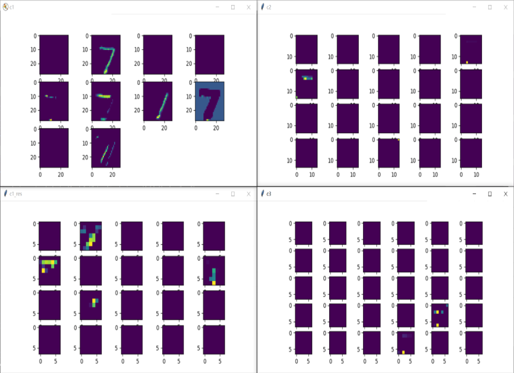

# This Week Summary

## 1. Result (Code:test_cnn.py)

### 1.1 Conv Layers Output

#### 1.1.1 Example 7:

#### 1.1.2 Example 2:

#### 1.1.3 Example 1:

#### 1.1.4 Example 0:

### 1.2 Conv Network Explain

    这是我自己看了LeNet网络后自己构造的CNN网络。
    
    其中网络从图片输入首先进过C1卷积层，C1采用5x5的卷积核，没有设置pooling（本意是直接让图片进来做个预处理，保留所有特征到下一层）。  
    
    进过C1后，网络有两分支，一条是经过C2和C3，一条直接进过C1_RES。  
    
    C2和C3均采用3x3的卷积核和maxpooling层，目的是提取小特征和小特征之间的高纬度联系。  
    
    C1_RES采用5x5的卷积核，进行视野更大的特征提取。  
    
### 1.3 Result Analyse
    
    从输出的中间层可以看到，网络应该是发生了overfitting，进过网络中已经采取了dropout的办法，但明显看到卷积层的大部分都没输出，空置的特征输出。  
        
    这个网络最终的测试集accuracy达到97%  
    