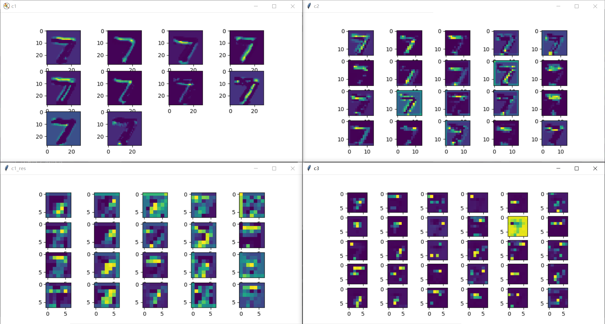
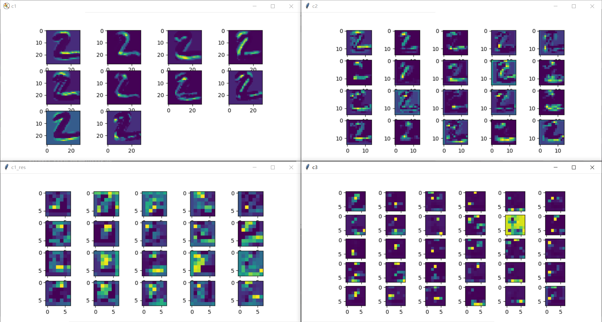
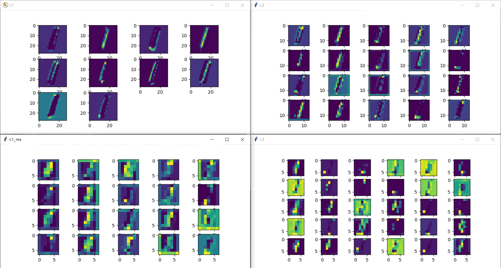

# This Week Summary

## 1. Result (Code:test_cnn.py)

### 1.1 Conv Layers Output

#### 1.1.1 Example 7:

#### 1.1.2 Example 2:

#### 1.1.3 Example 1:

### 1.2 Conv Network Explain

    这次的cnn网络结构（卷积层和池化层、全连接层的连接方式）和上次的一样。
    
    区别在于：这次在进入Activation Function Layer之前加了Batch Normalization，对进入激活函数的数据进行归一化处理。
    
    BN好处：1、避免分布数据偏移；2、远离导数饱和区
    
    引入BN的原因（我的思考）：
    
    1、上一周的实验出现卷积层大部分无特征输出原因可能是出现了梯度消失。dropout掉了一些特征后，由于梯度消失了，所以特征输出依赖于某几个特征，导致dropout掉的图像无法得到重新学习。
    
    2、使得输入数据、中间传输数据在进入激活函数前得到归一化，增强激活函数的作用和保证在有效的范围内工作。
    
    另外一点就是这次的Learning Rate进行了相应的调节，上次的LR偏高，间接影响正确率。
    
### 1.3 Result Analyse
    
    从上面特征层的输出可以看到已经没有了Week1出现特征过分依赖于仅仅几个的现象，特征分布比较均匀，而且因为dropout的引入，特征之间相似度不算高。
    
    这次相比于Week1有个特点，Week1的C1层输出已经有某些竖线、横线的特征提取了，但这次的C1输出只是做了初步的画像处理，特征的提取在后面层进行完成。这样的效果在我看来比Week1要好，完成了我的预想。
    
    这次的work在训练完第一个EPOCH时，测试集ACC已经达到了97%，我训练到了第十个EPOCH，1W测试集的准确率最后定格在了99.27%。

## 2. Result (Code:test_cnn2.py)

### 2.1 Conv Layers Output

- 层输出和上面的大同小异，此处不作绘制

### 2.2 Conv Network Explain

    在上面的网络中，基本accuracy已经达到99%了，但我感觉网络应该是还能提高几个点的，网络的参数还能进一步简化。
    
    这次的网络相比于上面的test_cnn.py，我全部采取了小卷积核（3x3），采用小卷积核级联的方式来替代大卷积核的效用，比如5x5的卷积核用2个3x3的卷积核来代替，7x7的卷积核用3个3x3来代替。
    
    小卷积核来替换大卷积核是有根据的：
    
    1. 首先这样级联的卷积核他们的在数据上的视野大小是一致;
    
    2. 同时小卷积核级联的总参数量少于大卷积核;
    
    同时，此次作品的神经网络布局也得到了进一步的整理，相比于作品一，修改的是支路。
    
    1. 目前的支路分别是两个（等效 5x5 卷积核 + 池化层）的串联 和 两个 （等效 7x7 卷积层 + 池化层）的串联。
    
    2. 之前的做法是两个支路直接展平接入fully connection layers，但目前将两个支路的输出合并后进入一个 3x3 的卷积核 和 池化层，对两支路提取的特征进一步压缩和整理后再进入全连接层。
    
    最后，此次的训练数据也采用了数据增强的方式：（见代码的 train_data_transform 函数）
    
    1、对图片进行随机的 -20° ~ 20°的旋转
    
    2、对图片进行随即裁剪
    
### 2.3 Result Analyse
    
    进行了一系列的修改和尝试后，总归是有所提升的。
    
    此次的网络相比于作品一，拟合速率更高。训练完第1个EPOCH时，1W测试集的准确率已达到了98%，第3个EPOCH后，准确率攀升到了99%，我一共训练了10个EPOCH，最后1W的测试集的准确率定格在了99.51%.  
    
    